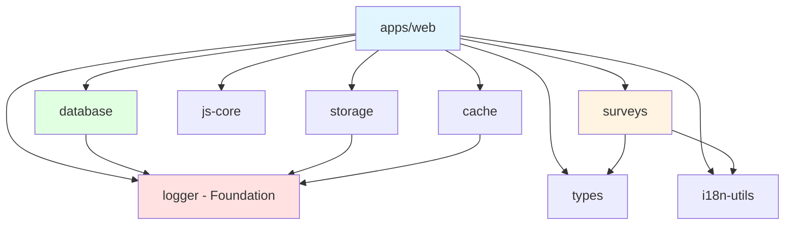

# Formbricks Repository Structure

**Analysis Commit:** [`341e263`](https://github.com/formbricks/formbricks/commit/341e2639e1a82270bf91af3ff35e7f420b9bf6e7)

---

## Overview

Formbricks uses a **pnpm monorepo** managed by **Turborepo** for efficient builds and caching. The repository follows a clean separation between applications (`apps/`) and reusable packages (`packages/`).

**Monorepo Stats:**
- **Workspaces:** 13 (2 apps + 11 packages)
- **Package Manager:** pnpm 9.15.9
- **Build Orchestrator:** Turborepo 2.5.3
- **Total TS/JS Files:** 1,934
- **Lines of Code:** ~54,710

---

## Directory Tree

```
formbricks/
├── apps/                      # Applications
│   ├── web/                  # Main Next.js application
│   └── storybook/            # Component documentation
│
├── packages/                  # Shared libraries
│   ├── cache/                # Redis caching layer
│   ├── config-eslint/        # Shared ESLint config
│   ├── config-prettier/      # Shared Prettier config
│   ├── config-typescript/    # Shared TypeScript configs
│   ├── database/             # Prisma schema & client
│   ├── i18n-utils/           # Internationalization utilities
│   ├── js-core/              # JavaScript SDK
│   ├── logger/               # Pino logging utilities
│   ├── storage/              # S3 storage abstraction
│   ├── surveys/              # Survey rendering engine
│   ├── types/                # TypeScript type definitions
│   └── vite-plugins/         # Custom Vite plugins
│
├── docs/                      # Mintlify documentation
├── docker/                    # Docker configurations
├── helm-chart/                # Kubernetes Helm charts
├── .github/                   # GitHub Actions workflows
├── .devcontainer/             # VS Code dev container
├── patches/                   # pnpm patches
│
├── turbo.json                 # Turborepo configuration
├── pnpm-workspace.yaml        # Workspace definition
├── package.json               # Root package.json
├── openapi.yml                # API specification
└── playwright.config.ts       # E2E test configuration
```

---

## Apps Directory

### 1. apps/web - Main Application

**Package:** `@formbricks/web`
**Framework:** Next.js 15.5.6 (App Router)
**Port:** 3000

#### Directory Structure

```
apps/web/
├── app/                      # Next.js App Router
│   ├── (app)/               # Authenticated routes (route group)
│   │   ├── (onboarding)/   # User onboarding flow
│   │   ├── (survey-editor)/# Survey editor
│   │   └── environments/    # Main app
│   │       └── [environmentId]/
│   │           ├── surveys/
│   │           ├── project/
│   │           ├── integrations/
│   │           └── settings/
│   │
│   ├── (auth)/              # Authentication routes
│   │   └── auth/
│   │       ├── login/
│   │       ├── signup/
│   │       ├── verify/
│   │       └── forgot-password/
│   │
│   ├── api/                 # API routes
│   │   ├── v1/             # Legacy API
│   │   │   ├── client/     # Client SDK endpoints
│   │   │   ├── management/ # Management API (CRUD)
│   │   │   ├── integrations/
│   │   │   └── webhooks/
│   │   │
│   │   ├── v2/             # Modern API
│   │   │   ├── client/     # Client endpoints
│   │   │   └── management/ # Resource management
│   │   │
│   │   ├── auth/           # NextAuth handlers
│   │   ├── billing/        # Stripe webhooks
│   │   └── (internal)/     # Internal endpoints
│   │       └── pipeline/   # Event pipeline
│   │
│   ├── s/[surveyId]/       # Public survey links
│   ├── c/[jwt]/            # Survey completion redirects
│   ├── setup/              # Initial setup wizard
│   └── storage/            # File upload endpoints
│
├── modules/                 # Feature modules (modern structure)
│   ├── account/            # User account management
│   ├── analysis/           # Survey response analysis
│   ├── api/                # API utilities
│   ├── auth/               # Authentication logic
│   ├── core/               # Core utilities (rate limiting)
│   │
│   ├── ee/                 # 🔒 Enterprise Edition
│   │   ├── audit-logs/    # Compliance logging
│   │   ├── billing/       # Stripe integration
│   │   ├── contacts/      # Advanced contact mgmt
│   │   ├── multi-language-surveys/
│   │   ├── quotas/        # Response quotas
│   │   ├── role-management/  # RBAC
│   │   ├── sso/           # SSO/SAML
│   │   ├── teams/         # Team management
│   │   ├── two-factor-auth/
│   │   └── whitelabel/    # Custom branding
│   │
│   ├── email/              # Email templates
│   ├── environments/       # Environment management
│   ├── integrations/       # Third-party integrations
│   ├── organization/       # Organization settings
│   ├── projects/           # Project configuration
│   ├── setup/              # Setup flows
│   ├── storage/            # File storage
│   │
│   ├── survey/             # Survey management
│   │   ├── components/    # Shared components
│   │   ├── editor/        # Survey builder
│   │   ├── follow-ups/    # Follow-up logic
│   │   ├── lib/           # Business logic
│   │   ├── link/          # Link surveys
│   │   ├── list/          # Survey listing
│   │   └── templates/     # Survey templates
│   │
│   ├── ui/                 # UI components library
│   └── utils/              # Shared utilities
│
├── lib/                     # Server-side utilities (legacy)
│   ├── actionClass/
│   ├── cache/
│   ├── display/
│   ├── environment/
│   ├── integration/
│   ├── organization/
│   ├── project/
│   ├── response/
│   ├── survey/
│   ├── user/
│   └── utils/
│
├── playwright/              # E2E tests
│   ├── api/
│   ├── fixtures/
│   └── utils/
│
├── public/                  # Static assets
│   ├── animated-bgs/
│   ├── image-backgrounds/
│   ├── favicon/
│   └── video/
│
├── locales/                 # i18n translations
│   ├── de/                 # German
│   ├── en/                 # English (default)
│   ├── es/                 # Spanish
│   ├── fr/                 # French
│   ├── pt/                 # Portuguese
│   ├── pt-BR/              # Brazilian Portuguese
│   ├── nl/                 # Dutch
│   ├── zh-CN/              # Chinese (Simplified)
│   └── ...
│
├── scripts/                 # Build scripts
│   ├── docker/
│   └── openapi/
│
├── next.config.mjs          # Next.js configuration
├── tailwind.config.ts       # Tailwind configuration
├── tsconfig.json            # TypeScript configuration
└── package.json
```

#### Key Patterns

**Route Groups:**
- `(app)` - Authenticated application routes
- `(auth)` - Public authentication pages
- `(onboarding)` - User onboarding flows
- `(survey-editor)` - Survey editing interface
- `(internal)` - Internal API endpoints

**Module Structure:**
```
modules/<feature>/
├── components/          # React components
├── lib/                # Business logic
├── actions/            # Server actions
├── hooks/              # React hooks
└── types/              # TypeScript types
```

**Example: Survey Module**
```typescript
// modules/survey/editor/components/SurveyEditor.tsx (Client)
"use client";
export const SurveyEditor = ({ surveyId }: Props) => { ... }

// modules/survey/editor/lib/survey-editor.ts (Server)
import "server-only";
export const updateSurvey = async (survey: TSurvey) => { ... }

// modules/survey/editor/actions.ts (Server Actions)
export const updateSurveyAction = authenticatedActionClient
  .schema(ZUpdateSurveyInput)
  .action(async ({ ctx, parsedInput }) => { ... });
```

### 2. apps/storybook - Component Documentation

**Package:** `storybook`
**Framework:** Storybook 9.0.15 with Vite
**Port:** 6006

```
apps/storybook/
├── .storybook/          # Configuration
│   ├── main.ts
│   └── preview.ts
├── stories/             # Component stories
│   ├── Button.stories.tsx
│   └── ...
└── package.json
```

---

## Packages Directory

### Foundation Layer (No Internal Dependencies)

#### 1. packages/logger - Logging Infrastructure

**Package:** `@formbricks/logger`
**Purpose:** Structured logging with Pino

**Structure:**
```
packages/logger/
├── src/
│   ├── logger.ts        # Main logger instance
│   └── index.ts         # Public exports
├── __tests__/
│   └── logger.test.ts
└── package.json
```

**Usage:**
```typescript
import { logger } from "@formbricks/logger";

logger.info("Survey created");
logger.error({ error, surveyId }, "Failed to create survey");
```

#### 2. packages/config-* - Shared Configurations

**packages/config-eslint:**
- Vercel Engineering Style Guide
- Consistent linting across packages

**packages/config-prettier:**
- Code formatting rules
- Import sorting
- Tailwind class sorting

**packages/config-typescript:**
- Base TypeScript configs
- Next.js, React, Node variants
- Strict mode enabled

### Service Layer (Depends on Foundation)

#### 3. packages/database - Database Layer

**Package:** `@formbricks/database`
**Dependencies:** `@formbricks/logger`

**Structure:**
```
packages/database/
├── schema.prisma        # Complete database schema
├── src/
│   ├── client.ts       # Prisma client singleton
│   └── index.ts        # Exports
├── migrations/          # Prisma migrations
├── migration/           # Custom data migrations
│   ├── migrations/
│   │   ├── 20240101000000_example/
│   │   │   ├── schema.sql
│   │   │   └── data.ts
│   └── utils/
├── zod/                 # Zod schemas for validation
│   ├── survey.ts
│   ├── user.ts
│   └── ...
└── package.json
```

**Key Features:**
- PostgreSQL with pgvector extension
- Type-safe Prisma client
- Zod runtime validation
- Custom migration system (schema + data)

**Schema Overview:**
- **Organizations**: Multi-tenant root
- **Projects**: Applications/products
- **Environments**: prod/dev separation
- **Surveys**: Survey definitions
- **Responses**: Survey submissions
- **Contacts**: Tracked users
- **Integrations**: Third-party connections

#### 4. packages/cache - Redis Caching

**Package:** `@formbricks/cache`
**Dependencies:** `@formbricks/logger`

**Structure:**
```
packages/cache/
├── src/
│   ├── client.ts       # Redis client factory
│   ├── service.ts      # CacheService class
│   ├── types.ts        # TypeScript types
│   └── index.ts
└── __tests__/
    └── cache.test.ts
```

**Features:**
- Singleton Redis client
- Graceful degradation (no errors on failure)
- Result type pattern
- TTL-based expiration

#### 5. packages/storage - S3 Storage

**Package:** `@formbricks/storage`
**Dependencies:** `@formbricks/logger`

**Structure:**
```
packages/storage/
├── src/
│   ├── client.ts       # S3 client factory
│   ├── service.ts      # Storage operations
│   ├── constants.ts    # Configuration
│   └── index.ts
└── __tests__/
    ├── client.test.ts
    ├── service.test.ts
    └── constants.test.ts
```

**Features:**
- AWS SDK v3 (modular)
- Presigned URL generation
- S3-compatible storage support (MinIO, etc.)
- Batch operations

#### 6. packages/i18n-utils - Internationalization

**Package:** `@formbricks/i18n-utils`

**Structure:**
```
packages/i18n-utils/
├── src/
│   ├── scan-translations.ts
│   ├── utils.ts
│   └── index.ts
└── __tests__/
    └── scan-translations.test.ts
```

### Domain Layer

#### 7. packages/types - Type Definitions

**Package:** `@formbricks/types`
**Build:** None (direct TypeScript imports)

**Structure:**
```
packages/types/
├── surveys/
│   ├── types.ts
│   └── validation.ts
├── integration/
│   ├── index.ts
│   ├── slack.ts
│   ├── notion.ts
│   ├── google-sheet.ts
│   └── airtable.ts
├── action-classes.ts
├── organizations.ts
├── project.ts
├── segment.ts
├── responses.ts
├── auth.ts
├── user.ts
├── js.ts
├── common.ts
├── error-handlers.ts
└── index.ts              # Re-exports everything
```

**Pattern:**
```typescript
// Type definition
export type TSurvey = { id: string; name: string; ... };

// Zod schema
export const ZSurvey = z.object({ id: z.string(), name: z.string(), ... });

// Inferred type (alternative)
export type TSurveyInferred = z.infer<typeof ZSurvey>;
```

#### 8. packages/surveys - Survey Rendering Engine

**Package:** `@formbricks/surveys`
**Dependencies:** `@formbricks/types`, `@formbricks/i18n-utils`
**Framework:** Preact (for lightweight bundle)

**Structure:**
```
packages/surveys/src/
├── components/
│   ├── general/         # Core components
│   │   ├── Survey.tsx
│   │   ├── WelcomeCard.tsx
│   │   ├── EndingCard.tsx
│   │   ├── ProgressBar.tsx
│   │   └── ...
│   ├── questions/       # Question types
│   │   ├── OpenTextQuestion.tsx
│   │   ├── MultipleChoiceQuestion.tsx
│   │   ├── RatingQuestion.tsx
│   │   ├── NPSQuestion.tsx
│   │   ├── CTAQuestion.tsx
│   │   ├── FileUploadQuestion.tsx
│   │   ├── DateQuestion.tsx
│   │   ├── MatrixQuestion.tsx
│   │   ├── RankingQuestion.tsx
│   │   └── ...
│   ├── buttons/         # UI controls
│   ├── icons/           # Icon library
│   ├── wrappers/        # Layout components
│   └── i18n/            # i18n provider
├── lib/
│   ├── constants.ts
│   ├── styles.ts
│   ├── i18n-utils.ts
│   └── ...
├── styles/              # CSS stylesheets
├── types/               # Type definitions
├── locales/             # Translations (10+ languages)
│   ├── en.json
│   ├── de.json
│   ├── es.json
│   └── ...
└── index.ts             # Public API
```

**Public API:**
```typescript
// Inline survey
renderSurveyInline(survey, containerId, config);

// Modal survey
renderSurveyModal(survey, config);
```

**Bundle:** ~150KB minified (includes i18n)

#### 9. packages/js-core - JavaScript SDK

**Package:** `@formbricks/js-core`

**Structure:**
```
packages/js-core/src/
├── lib/
│   ├── common/          # Core SDK logic
│   │   ├── setup.ts
│   │   ├── api.ts
│   │   ├── config.ts
│   │   ├── logger.ts
│   │   ├── command-queue.ts
│   │   ├── event-listeners.ts
│   │   └── tests/
│   ├── survey/          # Survey management
│   │   ├── widget.ts
│   │   ├── action.ts
│   │   ├── no-code-action.ts
│   │   ├── store.ts
│   │   └── tests/
│   ├── user/            # User management
│   │   ├── user.ts
│   │   ├── attribute.ts
│   │   └── tests/
│   └── environment/     # Environment config
│       └── environment.ts
├── types/
└── index.ts             # Main SDK export
```

**SDK Methods:**
```typescript
formbricks.setup({ environmentId, appUrl })
formbricks.setUserId(userId)
formbricks.setAttribute(key, value)
formbricks.track(code, properties)
formbricks.logout()
```

**Key Features:**
- Async command queue
- Local storage persistence
- No-code action tracking
- Survey eligibility evaluation

### Build Tools

#### 10. packages/vite-plugins - Custom Vite Plugins

**Package:** `@formbricks/vite-plugins`

**Structure:**
```
packages/vite-plugins/
├── src/
│   └── copy-compiled-assets/
│       └── index.ts
└── package.json
```

---

## Dependency Graph

### Internal Package Dependencies



### Build Order (Topological Sort)

1. **Foundation:** logger, config-*
2. **Services:** cache, database, storage, i18n-utils
3. **Domain:** types, js-core, surveys
4. **Applications:** web, storybook

**Parallel Build Opportunities:**
- cache, database, storage can build in parallel after logger
- types, js-core can build in parallel
- web and storybook independent

---

## Naming Conventions

### Files
- **Components:** PascalCase (`SurveyEditor.tsx`)
- **Utilities:** camelCase (`validateInput.ts`)
- **Types:** kebab-case (`action-classes.ts`)
- **Tests:** `*.test.ts`, `*.spec.ts`

### Directories
- **Route Groups:** `(app)`, `(auth)` - Next.js convention
- **Dynamic Routes:** `[environmentId]`, `[surveyId]`
- **Features:** kebab-case (`survey-editor`, `two-factor-auth`)

### Packages
- **Scope:** `@formbricks/*`
- **Names:** kebab-case (`@formbricks/js-core`)

---

## Configuration Files

### Root Level
| File | Purpose |
|------|---------|
| `turbo.json` | Turborepo build pipeline |
| `pnpm-workspace.yaml` | Workspace definition |
| `package.json` | Root dependencies & scripts |
| `.env.example` | Environment variable template |
| `playwright.config.ts` | E2E test configuration |
| `.eslintrc.cjs` | ESLint configuration |
| `.prettierrc.js` | Prettier configuration |

### apps/web
| File | Purpose |
|------|---------|
| `next.config.mjs` | Next.js build configuration |
| `tsconfig.json` | TypeScript configuration |
| `tailwind.config.ts` | Tailwind CSS configuration |
| `instrumentation.ts` | OpenTelemetry setup |
| `middleware.ts` | Next.js middleware |

---

## Code Organization Philosophy

### Modular Architecture

**Old Pattern (lib/):**
```
lib/survey/
├── service.ts     # All survey logic
└── utils.ts       # Helpers
```

**New Pattern (modules/):**
```
modules/survey/
├── editor/
│   ├── components/    # Editor UI
│   ├── lib/          # Editor logic
│   └── actions.ts    # Server actions
├── list/
│   ├── components/    # List UI
│   ├── lib/          # List logic
│   └── actions.ts
└── templates/
    └── ...
```

**Benefits:**
- Feature-based organization
- Colocation of related code
- Easier to navigate
- Better code splitting

### Enterprise Edition Separation

```
modules/
├── ee/                  # 🔒 Separate License
│   ├── LICENSE         # Enterprise license file
│   ├── audit-logs/
│   ├── billing/
│   └── ...
└── [other modules]     # AGPL-3.0
```

**Feature Flags:**
- License key validation
- Graceful degradation
- Clear separation

---

## Special Directories

### /docs - Documentation
- Mintlify-based documentation
- API reference
- Setup guides
- Deployment instructions

### /docker - Docker Configuration
- `Dockerfile` - Multi-stage production build
- `docker-compose.yml` - Production compose file
- `docker-compose.dev.yml` - Development services

### /helm-chart - Kubernetes Deployment
- Helm chart for Kubernetes
- Values files
- Templates for Deployment, Service, Ingress, etc.
- Dependencies: PostgreSQL, Redis

### /.github - CI/CD
- GitHub Actions workflows
- Issue templates
- Pull request templates
- Dependabot configuration

---

## Entry Points

### Applications
- **Web:** `apps/web/app/layout.tsx` → `page.tsx`
- **API:** `apps/web/app/api/**/route.ts`

### Packages
- **Database:** `packages/database/src/index.ts` (Prisma client)
- **Types:** `packages/types/index.ts` (type exports)
- **Surveys:** `packages/surveys/src/index.ts` (render functions)
- **JS-Core:** `packages/js-core/src/index.ts` (SDK object)
- **Logger:** `packages/logger/src/index.ts` (logger instance)

---

## Development Workflow

### Local Development

```bash
# Install dependencies
pnpm install

# Start database & services
pnpm db:up

# Apply migrations
pnpm db:migrate:dev

# Start all apps
pnpm dev

# Or start specific app
pnpm --filter @formbricks/web dev
```

### Building

```bash
# Build all packages
pnpm build

# Build specific package
pnpm --filter @formbricks/database build
```

### Testing

```bash
# Run all tests
pnpm test

# E2E tests
pnpm test:e2e

# Specific package tests
pnpm --filter @formbricks/cache test
```

---

## Best Practices Observed

1. **Server-Only Directive:** Critical server code marked with `"server-only"`
2. **Type Safety:** Zod schemas generate both runtime validators and types
3. **Consistent Structure:** All modules follow similar patterns
4. **Clear Separation:** Business logic separate from UI components
5. **Dependency Direction:** Services depend on foundation, not vice versa
6. **No Circular Dependencies:** Clean dependency graph
7. **Monorepo Benefits:** Shared tooling, consistent formatting

---

## Future Considerations

1. **Module Migration:** Continue migrating `lib/` to `modules/` structure
2. **Package Extraction:** Consider extracting more shared packages
3. **Build Optimization:** Leverage Turbo remote caching
4. **Documentation:** Generate API docs from JSDoc/TypeScript

---

*This document provides a comprehensive map of the Formbricks repository structure as of commit 341e263. For the latest changes, refer to the GitHub repository.*
